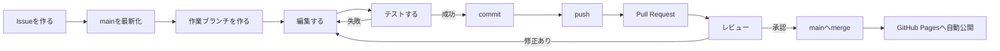
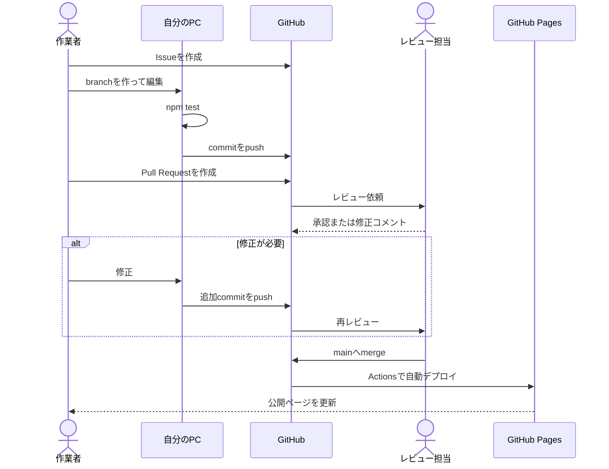
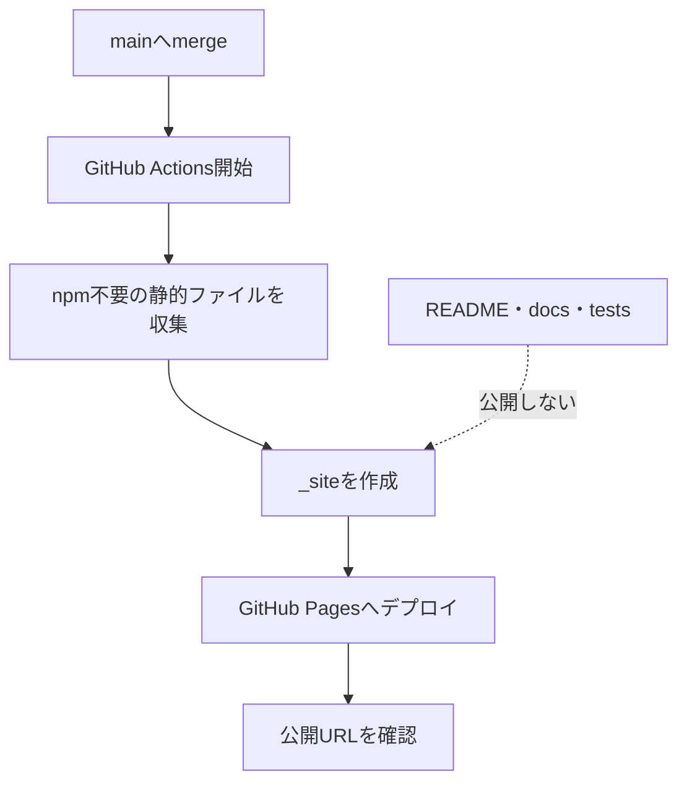

# 試験対策PWAスターター

GitやGitHubを初めて使う人でも、少しずつ教材を追加しながら共同開発できるようにした静的PWAです。

- 公開ページ: https://ma-garin.github.io/jstqb-learning-app/
- 教材データ: [`js/content.js`](js/content.js)
- 公開前チェック: [`docs/rights-safety-checklist.md`](docs/rights-safety-checklist.md)

問題、解説、学習マップ、用語は初期状態では空です。完成済みの教材や資格固有データは含みません。

## 最初に覚えること

共同開発では、`main`を直接編集せず、作業ごとにブランチを作ります。

1. GitHubのIssueに「何をするか」を書く
2. 自分のPCを最新状態にする
3. 作業用ブランチを作る
4. ファイルを編集する
5. テストする
6. commitしてGitHubへpushする
7. Pull Requestを作る
8. 別の人が確認する
9. 問題がなければmainへmergeする
10. GitHub Pagesへの反映を確認する



## Git用語集

| 用語 | 意味 |
| --- | --- |
| repository | ファイルと変更履歴を保存するプロジェクト全体 |
| clone | GitHub上のrepositoryを自分のPCへ複製すること |
| main | 公開可能な状態を保つ基準ブランチ |
| branch | mainから分けて作る安全な作業場所 |
| commit | 変更内容に名前を付けて履歴へ保存すること |
| push | PC上のcommitをGitHubへ送ること |
| pull | GitHub上の変更をPCへ取り込むこと |
| Pull Request / PR | 作業ブランチをmainへ取り込むための確認依頼 |
| review | Pull Requestの内容を別の人が確認すること |
| merge | Pull Requestの変更をmainへ取り込むこと |
| conflict | 同じ場所を別々に編集し、Gitが自動判断できない状態 |

## このリポジトリの構成

```text
.
├── index.html                 # ホーム
├── study.html                 # 演習設定
├── quiz.html                  # 問題回答
├── result.html                # 結果
├── learning-map.html          # 学習マップ
├── glossary.html              # 用語集
├── settings.html              # 設定
├── css/app.css                # 全画面のスタイル
├── js/content.js              # 問題・学習マップ・用語
├── js/*.js                    # 各画面の処理
├── img/                       # PWAアイコン
├── manifest.json              # PWA設定
├── sw.js                      # オフラインキャッシュ
├── tests/                     # 自動テスト
├── docs/                      # 公開前チェック資料
└── .github/workflows/         # GitHub Pages自動公開設定
```

普段、教材追加で主に編集するのは`js/content.js`です。

## 1. 開発を始める準備

### 1-1. 必要なもの

- GitHubアカウント
- Git
- Node.js 20.19以上
- テキストエディタ。Visual Studio Codeなど

インストール後、ターミナルで確認します。

```bash
git --version
node --version
npm --version
```

`command not found`と表示された場合は、そのソフトウェアがまだ利用できません。

### 1-2. Gitへ名前とメールアドレスを登録する

最初の1回だけ実行します。メールアドレスはGitHubアカウントに登録したものを使います。

```bash
git config --global user.name "GitHubで使う名前"
git config --global user.email "メールアドレス"
```

確認方法:

```bash
git config --global user.name
git config --global user.email
```

メールアドレスを公開したくない場合は、GitHubの`Settings > Emails`に表示されるnoreplyアドレスを利用できます。

### 1-3. 共同開発者をGitHubへ招待する

リポジトリ管理者が行います。

1. GitHubでこのリポジトリを開く
2. `Settings`を開く
3. `Collaborators`を開く
4. `Add people`からGitHubユーザーを招待する
5. 招待された人が承認する

パスワード、アクセストークン、秘密鍵は相手に渡しません。

## 2. 初回だけ行うclone

作業を置きたいフォルダへ移動し、次を実行します。

```bash
git clone https://github.com/ma-garin/jstqb-learning-app.git
cd jstqb-learning-app
npm ci
npm test
```

テスト結果に次のような表示があれば準備完了です。

```text
Test Files  4 passed
Tests       19 passed
```

数値はテスト追加によって変わる場合があります。重要なのは`failed`がなく、終了時にエラーが出ないことです。

### ローカルで画面を確認する

```bash
python3 -m http.server 8000
```

ブラウザで次を開きます。

```text
http://127.0.0.1:8000/
```

停止するときは、サーバーを起動したターミナルで`Ctrl + C`を押します。

## 3. 毎回の共同開発手順

以下は作業のたびに繰り返します。

### 3-1. Issueを作る

GitHubの`Issues > New issue`から、今回行う作業を1つ書きます。

例:

```markdown
## やること
境界値分析の独自問題を1問追加する

## 完了条件
- 問題、4つの選択肢、正解、解説がある
- 内容が独自作成である
- npm testが成功する
- ブラウザで回答できる
```

1つのIssueへ多くの作業を詰め込まず、短時間で確認できる大きさにします。

### 3-2. mainを最新状態にする

ターミナルでリポジトリへ移動して実行します。

```bash
git switch main
git pull --ff-only origin main
```

`git pull --ff-only`は、意図しないmerge commitができるのを防ぎます。

### 3-3. 作業用ブランチを作る

```bash
git switch -c content/add-boundary-value-question
```

ブランチ名は、英小文字とハイフンを使うと読みやすくなります。

| 種類 | 例 |
| --- | --- |
| 教材追加 | `content/add-test-design-question` |
| 画面改善 | `ui/improve-home-message` |
| 不具合修正 | `fix/glossary-search` |
| 文書修正 | `docs/update-readme` |

現在のブランチを確認します。

```bash
git branch --show-current
```

`main`と表示された場合は、編集を始める前に作業ブランチへ切り替えます。

### 3-4. ファイルを編集する

教材は`js/content.js`へ追加します。保存後、まず変更状況を確認します。

```bash
git status
git diff
```

- `git status`: どのファイルが変わったかを表示
- `git diff`: ファイルのどこが変わったかを表示

意図しないファイルや秘密情報が含まれていないか確認します。

### 3-5. テストする

```bash
npm test
```

画面に関係する変更では、ローカルサーバーも起動して確認します。

```bash
python3 -m http.server 8000
```

最低限、次を確認します。

- ページが表示される
- リンクやボタンが動く
- 追加した問題や用語が表示される
- ブラウザの開発者ツールに赤いエラーがない
- スマートフォン幅でも読める

### 3-6. commitする

commitするファイルを指定します。

```bash
git add js/content.js
git status
```

`Changes to be committed`へ意図したファイルだけが表示されたらcommitします。

```bash
git commit -m "content: add boundary value analysis question"
```

commitメッセージは「何をしたか」が分かる短い文にします。

| 接頭辞 | 用途 |
| --- | --- |
| `content:` | 問題、用語、学習マップ |
| `feat:` | 新しい機能 |
| `fix:` | 不具合修正 |
| `ui:` | 表示やデザイン |
| `docs:` | READMEや文書 |
| `test:` | テスト |
| `ci:` | GitHub Actions |

### 3-7. GitHubへpushする

初回のpush:

```bash
git push -u origin content/add-boundary-value-question
```

2回目以降は次だけで送れます。

```bash
git push
```

### 3-8. Pull Requestを作る

push後にGitHubを開くと、`Compare & pull request`ボタンが表示されます。

1. `base`が`main`であることを確認する
2. `compare`が自分の作業ブランチであることを確認する
3. 変更内容と確認結果を書く
4. レビュー担当者を指定する
5. `Create pull request`を押す

PR本文の例:

```markdown
## 変更内容
- 境界値分析の独自問題を1問追加
- 正解理由と誤答理由を解説へ追加

## 確認結果
- [x] npm test
- [x] ローカル画面で回答
- [x] スマートフォン幅で表示
- [x] 独自作成であることを確認

## 関連Issue
Closes #12
```

`Closes #12`の番号を実際のIssue番号へ変えると、merge時にIssueも自動で閉じます。

### 3-9. レビューする

レビュー担当者は、次を確認します。

- Issueの完了条件を満たしているか
- 問題、正解、解説に矛盾がないか
- 第三者の文章をコピーしていないか
- 不要なファイルや秘密情報がないか
- テストが成功しているか
- 表示や操作が壊れていないか

修正が必要な場合は、PRへコメントします。作業者は同じブランチで修正し、再度commitとpushを行います。PRは自動で更新されるため、作り直す必要はありません。

### 3-10. mergeして公開を確認する

レビュー後、GitHubの`Merge pull request`を使ってmainへ取り込みます。

mainへのpushを検知すると、GitHub ActionsがPagesを自動更新します。



公開状況はGitHubの`Actions`タブで確認します。

- 緑のチェック: 成功
- 黄色の丸: 実行中
- 赤いバツ: 失敗。ログを確認して修正する

公開ページ:

```text
https://ma-garin.github.io/jstqb-learning-app/
```

GitHub Pagesにはキャッシュがあります。反映直後に古い表示が出る場合は少し待ち、再読み込みします。

### 3-11. 作業後の片付け

merge後、自分のPCを最新化します。

```bash
git switch main
git pull --ff-only origin main
git branch -d content/add-boundary-value-question
```

次の作業では、最新のmainから新しいブランチを作ります。同じブランチを使い回しません。

## 共同開発のGitモデル

```mermaid
gitGraph
    commit id: "main: 公開可能"
    branch content/add-question
    checkout content/add-question
    commit id: "問題を追加"
    commit id: "レビュー修正"
    checkout main
    merge content/add-question id: "PRをmerge"
    branch ui/improve-home
    checkout ui/improve-home
    commit id: "ホームを改善"
    checkout main
    merge ui/improve-home id: "PRをmerge"
```

mainは常に公開可能な状態を保ちます。未完成の変更や実験は作業ブランチで行います。

## 教材データの追加方法

教材は[`js/content.js`](js/content.js)の3つの配列へ追加します。

### 問題

```js
{
  id: 'course-001',
  topic: '自作テーマ',
  question: '独自に作成した問題文',
  choices: ['選択肢A', '選択肢B', '選択肢C', '選択肢D'],
  correctAnswerIndex: 0,
  explanation: '独自に作成した解説'
}
```

注意点:

- `id`は他の問題と重複させない
- `choices`は4つ用意する
- `correctAnswerIndex`は0から数える
- 最初の選択肢が正解なら`0`、2番目なら`1`
- 解説には正解理由だけでなく、誤解しやすい点も書く

### 学習マップ

```js
{
  id: 'topic-001',
  title: '学習テーマ',
  description: 'このテーマで学ぶ内容'
}
```

### 用語

```js
{
  term: '用語',
  definition: '独自に作成した説明'
}
```

## コンテンツの権利ルール

- 問題文、選択肢、解説、教材本文は独自作成または利用許諾済みのものだけを使う
- 公式問題、書籍、講座、Web教材を転載・翻訳・軽く言い換えて使わない
- 公式PDFや教材ファイルをrepositoryへ保存しない
- ロゴ、商標、資格名は権利と公式誤認リスクを確認する
- 外部資料は原則としてURLと必要最小限の情報だけを扱う
- 引用が必要な場合は範囲、出典、利用条件を確認する
- APIキー、パスワード、個人情報、`.env`をcommitしない
- PRで内容と権利を別の人が確認する

詳しい確認項目は[`docs/rights-safety-checklist.md`](docs/rights-safety-checklist.md)を使用します。

## 困ったとき

### 今どのブランチか分からない

```bash
git branch --show-current
git status
```

### 変更したが、まだcommitしたくない

そのままで問題ありません。`git status`で変更は確認できます。作業を一時退避する必要がある場合は、内容を理解してから`git stash`を使います。

```bash
git stash push -m "作業途中"
git switch main
```

戻すとき:

```bash
git switch 作業ブランチ名
git stash pop
```

### 間違ったファイルをgit addした

ファイルの編集内容は残したまま、commit対象から外します。

```bash
git restore --staged ファイル名
```

### 直前のcommitメッセージを間違えた

まだpushしていない場合:

```bash
git commit --amend -m "正しいメッセージ"
```

push済みの場合は履歴を書き換えず、原則としてそのままにします。共同開発中の無断force pushは禁止です。

### pullすると「local changes」と表示される

未commitの変更が残っています。まず確認します。

```bash
git status
git diff
```

必要な変更なら作業ブランチでcommitします。不要か判断できない変更を削除しないでください。

### conflictが発生した

慌ててファイルを削除したり、`git reset --hard`を実行したりしません。

1. `git status`で対象ファイルを確認する
2. ファイル内の`<<<<<<<`、`=======`、`>>>>>>>`を探す
3. 残す内容を共同開発者と確認する
4. 記号を削除して正しい内容へ編集する
5. テストする
6. `git add`してcommitする

判断できない場合は、その時点の`git status`とエラーメッセージを共有します。

### 間違った変更を公開してしまった

共有済みの履歴を消すのではなく、取り消すcommitを作る`git revert`が基本です。対象commitを確認し、共同開発者と合意して実行します。

```bash
git log --oneline
git revert 対象のcommit-ID
git push origin main
```

### GitHubへpushできない

次を確認します。

- GitHubの招待を承認しているか
- `git remote -v`が正しいか
- GitHubへログインできているか
- 作業ブランチをpushしているか
- エラーメッセージに認証、権限、通信のどれが書かれているか

```bash
git remote -v
git branch --show-current
```

## やってはいけない操作

意味と影響を理解し、共同開発者と合意するまでは次を実行しません。

```text
git push --force
git reset --hard
git clean -fd
git filter-repo
```

これらは共有履歴や未保存ファイルを失う可能性があります。

## GitHub Pagesの仕組み

`.github/workflows/deploy.yml`は、mainへのpushを検知すると公開対象だけを`_site`へ集約してデプロイします。



Pagesへ公開するもの:

- HTML
- `css/app.css`
- `js/*.js`
- PWAアイコン
- `manifest.json`
- `sw.js`

README、docs、tests、開発用設定はPages成果物へ含めません。

## Git履歴の扱い

現在のファイルを削除しても、過去commitには旧ファイルが残る場合があります。履歴からも完全に除去する必要がある場合は、共同開発者と合意したうえで次のどちらかを選びます。

- 必要なファイルだけをコピーして新規repositoryを作成する
- バックアップと影響範囲を確認して`git filter-repo`を使用する

履歴改変は既存clone、Pull Request、commit URLへ影響します。無断のforce pushは行いません。

## Pull Request公開前チェック

- [ ] Issueの完了条件を満たした
- [ ] `main`ではなく作業ブランチで変更した
- [ ] `git diff`で意図しない変更がない
- [ ] `npm test`が成功した
- [ ] 主要画面をブラウザで確認した
- [ ] コンソールエラーがない
- [ ] HTMLから参照するファイルに欠落がない
- [ ] 問題、選択肢、正解、解説に矛盾がない
- [ ] 教材が独自作成または利用許諾済みである
- [ ] PDF、秘密情報、個人情報を含めていない
- [ ] アプリ名、説明、アイコンが公式サービスに見えない
- [ ] PR本文に変更内容と確認結果を書いた
- [ ] 別の人へレビューを依頼した

## よく使うコマンド早見表

```bash
# 状態確認
git status
git diff
git branch --show-current

# mainを最新化
git switch main
git pull --ff-only origin main

# 作業開始
git switch -c content/add-example-question

# テスト
npm test

# commit
git add js/content.js
git commit -m "content: add example question"

# GitHubへ送る
git push -u origin content/add-example-question

# merge後の片付け
git switch main
git pull --ff-only origin main
git branch -d content/add-example-question
```

迷った場合は、削除・reset・force pushを行う前に、`git status`と`git diff`を確認して共同開発者へ共有してください。
